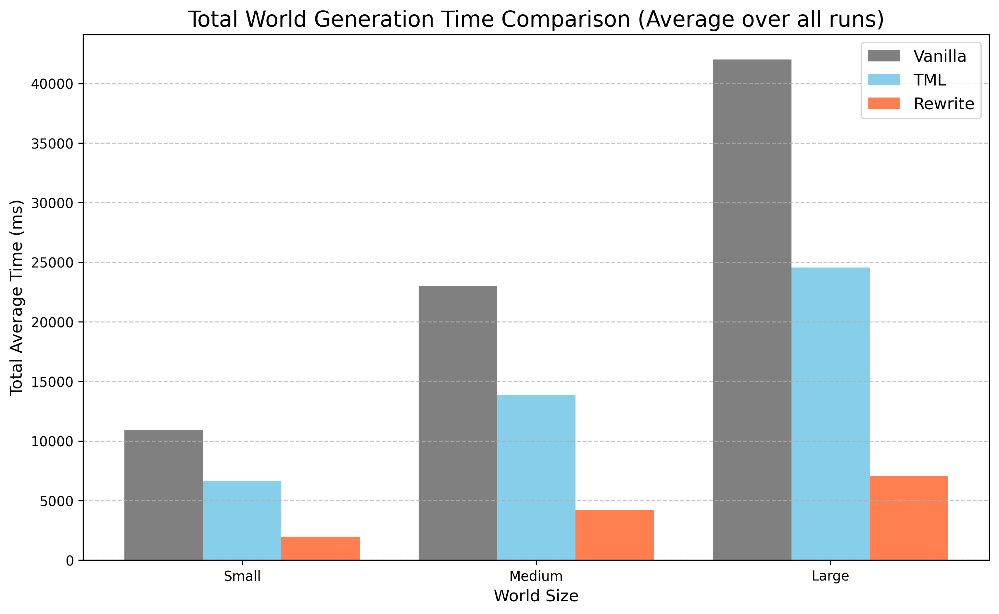
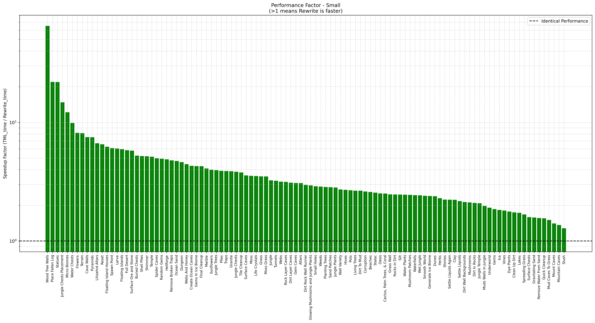
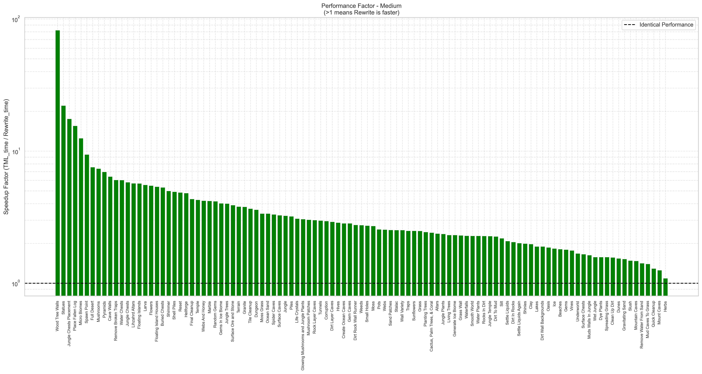
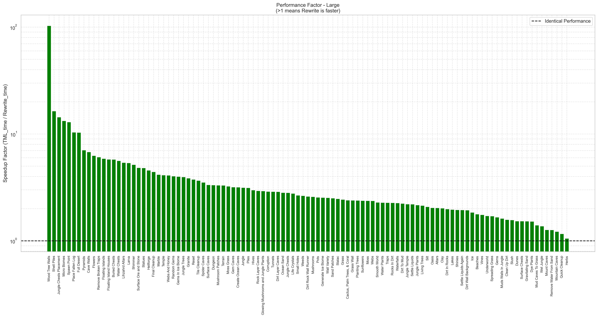
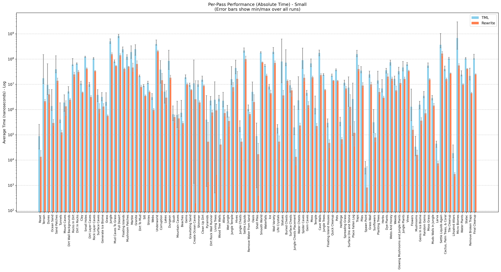
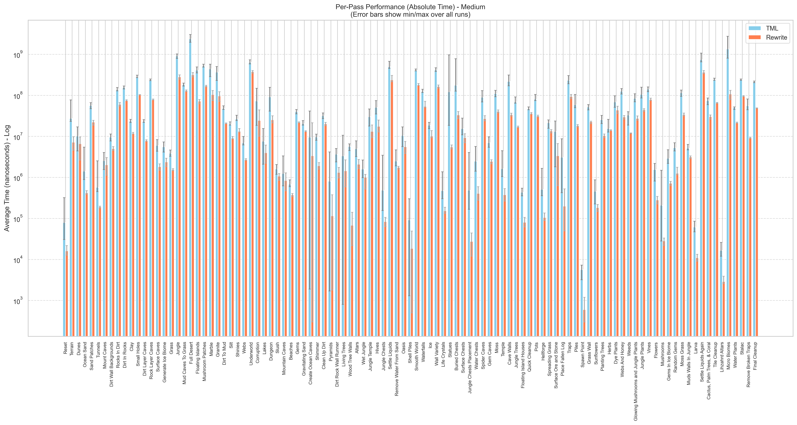
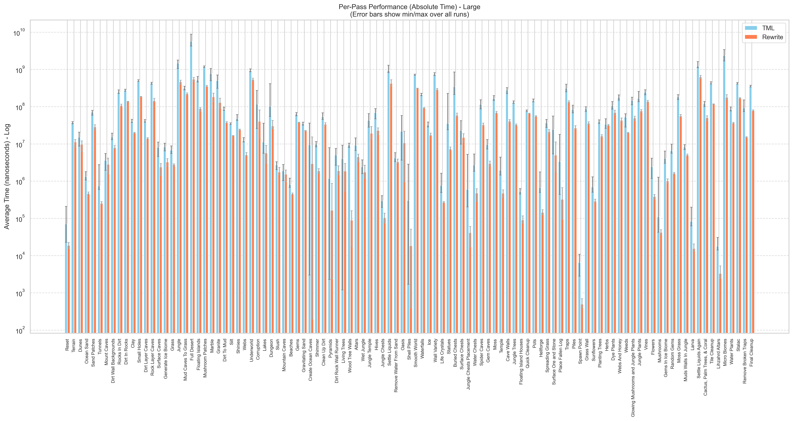
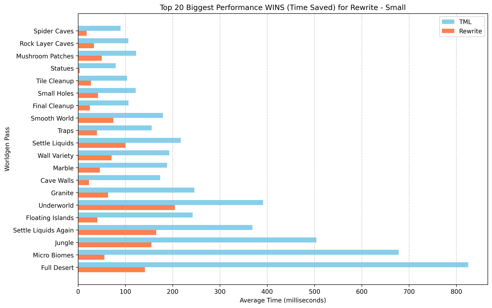
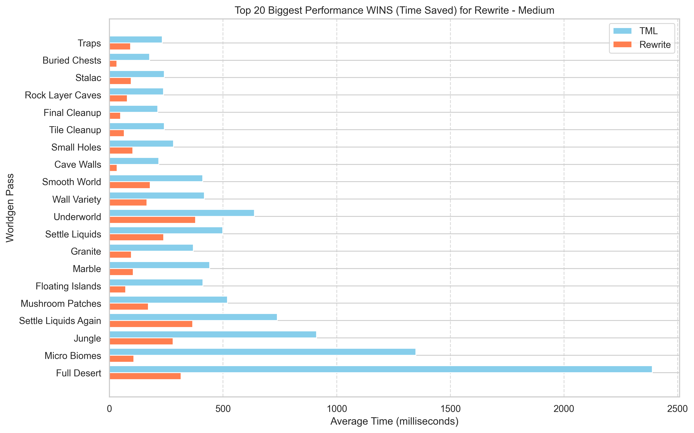
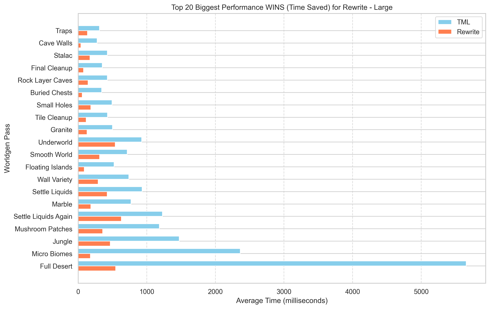

# VanillaWorldGenCPP

Full 1:1 bit for bit accurate Terraira WorldGen rewrite in C++. ~3.3x faster than TML, ~5.5x faster than Vanilla.

## Benchmark Results
All benchmarks were run on the same set of 50 random seeds. Benchmarked against 1.4.4.9.

### Summary

**Total Time comparision**

  

This project is, on average:
- **~5.5x faster** than vanilla Terraria.
- **~3.3x faster** than tModLoader.

---

<strong>Click here for Detailed Performance Breakdowns</strong>

### Performance Factor (How many times faster)
*This shows the speedup factor of VanillaWorldGenCPP compared to TML.*
| Small Worlds | Medium Worlds | Large Worlds |
| :---: | :---: | :---: |
|  |  |  |

### Per-Pass Absolute Timings (ns)
*This shows the absolute time spent in each world generation pass.*
| Small Worlds | Medium Worlds | Large Worlds |
| :---: | :---: | :---: |
|  |  |  |

### Top 20 best performers
*A closer look at the 20 passes with the most time saved*
| Small Worlds | Medium Worlds | Large Worlds |
| :---: | :---: | :---: |
|  |  |  |

## Why?
Haha cpu go BRRRRRRRRRRRRRRRRR. I just wanted to make Terraria Worldgen fast. Fast enough to generate every seed and find optimal seeds for speedrunners. A standalone multithreaded version exists, it is not yet public.

## How?
Hundreds of hours cleaning and optimizing. Better algorithms. Better data structures. Better memory layout and cache optimization. SIMD, vectorization, using a good compiler (thank you Clang!).

Optimizing while maintaining 1:1 vanilla compatibility is hard. Mathematically equivalent code does not matter when floating point precision errors exist. Every random call must be done in the same order.